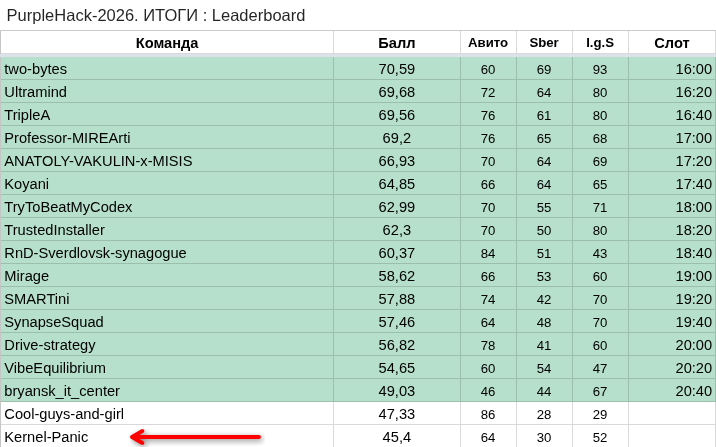

# IT Purple Hack 2026 — LLM Hallucination Detection (Sber)

Проект для обнаружения фактологических галлюцинаций в ответах LLM-модели GigaChat.

## Описание проекта

Проект разработан в рамках хакатона IT Purple Hack 2026 (трек от Sber).

Основная задача:
- определять, является ли ответ LLM фактологической галлюцинацией
- оценивать вероятность того, что ответ содержит галлюцинацию

Подход основан на анализе скрытых представлений (hidden states) модели GigaChat и последующей классификации с помощью XGBoost.

Более подробная информация по заданию:
`sber.md`

---

## Используемые технологии

- LLM: GigaChat (русскоязычная модель)
- Основная модель: XGBoost
- Подход:
  - извлечение признаков из hidden states
  - классификация галлюцинаций

---

## Требования

Перед запуском:

- Python (~ 3.12, проектировался в среде Kaggle)
- Интернет-соединение
- От 30 GiB VRAM

---

## Используемые библиотеки

| Категория            | Библиотеки |
|---------------------|------------|
| Data Processing     | pandas, numpy |
| Machine Learning    | sklearn, xgboost |
| Deep Learning       | torch, transformers |
| Visualization       | matplotlib, seaborn |
| Utils               | os, gc, time, warnings, pickle, joblib |
| Statistics          | scipy.stats |
| Progress / Misc     | tqdm |

*Примечание: в финальной версии проекта некоторые библиотеки могут быть импортированы, но не использоваться.*

---

## Как пользоваться

### Директория `notebooks`

#### 1. Извлечение признаков
Файл: `feature_extraction.ipynb`

- извлекает признаки из hidden states GigaChat
- работает с подготовленным датасетом

---

#### 2. Обучение модели
Файл: `train.ipynb`

- обучает XGBoost классифицировать:
  - галлюцинации
  - корректные ответы

---

#### 3. Оценка на публичном бенчмарке
Файл: `score_public.ipynb`

- оценивает модель на `knowledge_bench_public.csv`
- сохраняет предсказания и вероятности

---

#### 4. Предсказание на финальном датасете
Файл: `score_private.ipynb`

- делает предсказания на:
  - `knowledge_bench_private_no_labels.csv`
- сохраняет результат:
  - `knowledge_bench_private_scores.csv`

---

## Данные

### Директория `data/public`

| Файл | Описание |
|------|----------|
| `shiza.csv` | использовался для извлечения фичей из GigaChat |
| `knowledge_bench_public.csv` | публичный датасет для оценки |
| `knowledge_bench_public_results.csv` | предсказания и вероятности модели |

---

### Директория `data/private`

| Файл | Описание |
|------|----------|
| `knowledge_bench_private_no_labels.csv` | финальный датасет без меток |
| `knowledge_bench_private_scores.csv` | предсказания вероятностей модели |

---

## Итоговые метрики (public benchmark)

### Качество модели

| Метрика   | Значение |
|----------|----------|
| PR-AUC   | 0.7029 |
| ROC-AUC  | 0.6397 |
| Accuracy | 0.6054 |
| Precision| 0.6816 |
| Recall   | 0.5106 |
| F1-score | 0.5838 |

---

### Производительность

| Метрика | Значение |
|--------|----------|
| Model forward (mean) | 485.0 ms |
| Model forward (max) | 1479.1 ms |
| Overhead (mean) | 69.07 ms |
| Overhead (max) | 194.50 ms |
| Overhead p99 | 134.79 ms |
| Статус | PASS (p99 < 500 ms) |

---

## Итог

Проект позволяет:
- автоматически выявлять галлюцинации в ответах LLM
- оценивать вероятность их возникновения
- использовать hidden states как источник признаков

## Результаты хакатона

Проект разработан командой **Kernel Panic** в рамках IT Purple Hack 2026.

Итог:
- место: **топ 17**

Подробные результаты доступны в [официальной таблице хакатона](https://docs.google.com/spreadsheets/d/e/2PACX-1vSF-GLrUazcJdbp5FpbmtxhdfKV7dy3wCsHEVWsTE4u9uZVt-nsfJJbo7Za5QsFRzJg6xopbvYp3G6W/pubhtml?gid=8405226&single=true).

### Скриншот таблицы

